# Flowcharts & Sequence Diagrams
## "Membangun ~~Candi~~ Apps Dalam Semalam"

---

## 1. OVERALL PRESENTATION FLOW

```mermaid
graph TD
    Start([🎬 Start Presentation]) --> Cover[Slide 1: Cover Page]
    Cover --> Bab1{BAB 1: Why We Need<br/>To Make Apps Fast}
    
    Bab1 --> B1S1[Speed Revolution]
    B1S1 --> B1S2[AI Era Transformation]
    B1S2 --> B1S3[Breaking Code Barrier]
    B1S3 --> B1S4[New Playbook]
    
    B1S4 --> Bab2{BAB 2: Ideation}
    Bab2 --> B2S1[Ideas That Matter]
    B2S1 --> B2S2[Finding Gold in Problems]
    B2S2 --> B2S3[SaaS vs Custom Build]
    B2S3 --> B2S4[Niche Market Goldmines]
    B2S4 --> B2S5[Validation Framework]
    
    B2S5 --> Bab3{BAB 3: What We Need}
    Bab3 --> B3S1[Toolkit Lengkap]
    B3S1 --> B3S2[Essential Toolkit]
    B3S2 --> B3S3[Backend vs Frontend]
    B3S3 --> B3S4[Tech Stack Matchmaking]
    B3S4 --> B3S5[Free Resources]
    
    B3S5 --> Bab4{BAB 4: Let's Create<br/>PLAN}
    Bab4 --> B4S1[Blueprint to Reality]
    B4S1 --> B4S2[AI Planning Process]
    B4S2 --> B4S3[Ideation to Execution]
    B4S3 --> B4S4[Logic & Functionality]
    B4S4 --> B4S5[UI/UX Specification]
    B4S5 --> B4S6[Magic Deliverables]
    
    B4S6 --> Bab5{BAB 5: Eksekusi}
    Bab5 --> B5S1[Execution Mode]
    B5S1 --> B5S2[Sequential Flow]
    B5S2 --> B5S3[AI Task Breakdown]
    B5S3 --> B5S4[Different Stack Flow]
    B5S4 --> B5S5[Execution Mantras]
    
    B5S5 --> Bab6{BAB 6: Quality<br/>Assurance}
    Bab6 --> B6S1[Test Everything]
    B6S1 --> B6S2[Role Switch PM→QA]
    B6S2 --> B6S3[Bug Reporting to AI]
    B6S3 --> B6S4[TypeScript Error Fix]
    B6S4 --> B6S5[QA Power Prompt]
    B6S5 --> B6S6[Ship-Ready Criteria]
    
    B6S6 --> Bab7{BAB 7: Deploy<br/>& Publish}
    Bab7 --> B7S1[Go Live]
    B7S1 --> B7S2[Pre-Deployment Protocol]
    B7S2 --> B7S3[Git Repository Setup]
    B7S3 --> B7S4[Platform Deploy]
    B7S4 --> B7S5[Post-Deploy Monitor]
    
    B7S5 --> Bab8{BAB 8: Portfolio}
    Bab8 --> B8S1[Proof of Concept]
    B8S1 --> B8S2[Online Projects]
    B8S2 --> B8S3[Offline Projects]
    B8S3 --> B8S4[The Numbers]
    B8S4 --> B8S5[Closing & Connect]
    
    B8S5 --> End([🎉 Thank You<br/>Q&A])
    
    style Start fill:#00d4ff,stroke:#fff,stroke-width:3px,color:#000
    style End fill:#8b5cf6,stroke:#fff,stroke-width:3px,color:#fff
    style Bab1 fill:#0a1929,stroke:#00d4ff,stroke-width:2px,color:#00d4ff
    style Bab2 fill:#0a1929,stroke:#00d4ff,stroke-width:2px,color:#00d4ff
    style Bab3 fill:#0a1929,stroke:#00d4ff,stroke-width:2px,color:#00d4ff
    style Bab4 fill:#0a1929,stroke:#00d4ff,stroke-width:2px,color:#00d4ff
    style Bab5 fill:#0a1929,stroke:#00d4ff,stroke-width:2px,color:#00d4ff
    style Bab6 fill:#0a1929,stroke:#00d4ff,stroke-width:2px,color:#00d4ff
    style Bab7 fill:#0a1929,stroke:#00d4ff,stroke-width:2px,color:#00d4ff
    style Bab8 fill:#0a1929,stroke:#00d4ff,stroke-width:2px,color:#00d4ff
```

---

## 2. NAVIGATION FLOW


---

## 3. BAB 1 - WHY WE NEED TO MAKE APPS FAST

### 3.1 Chapter Flow


### 3.2 Sequence Diagram


---

## 4. BAB 2 - IDEATION

### 4.1 Chapter Flow


### 4.2 Sequence Diagram

```mermaid
sequenceDiagram
    participant User
    participant Slide
    participant AI
    participant Validation
    
    User->>Slide: Navigate to BAB 2
    Slide-->>User: "Ideas That Matter"
    
    User->>Slide: Next
    Slide-->>User: Finding Gold in Problems
    User->>AI: What problems exist around me?
    AI-->>User: List of local pain points
    
    User->>Slide: Next
    Slide-->>User: SaaS vs Custom Build
    User->>User: Evaluate business model
    Note over User: SaaS = Better scaling
    
    User->>Slide: Next
    Slide-->>User: Niche Market Goldmines
    User->>AI: Analyze market for [niche]
    AI-->>User: Market size, competition, pricing
    
    User->>Slide: Next
    Slide-->>User: Validation Framework
    User->>Validation: Check idea against criteria
    Validation-->>User: ✅ Real problem
    Validation-->>User: ✅ People will pay
    Validation-->>User: ✅ Can build MVP fast
    Validation-->>User: ✅ Scalable
    Validation-->>User: ✅ Maintainable
    
    alt All Criteria Met
        User->>User: Proceed to Planning
    else Some Criteria Failed
        User->>User: Refine idea & re-validate
    end
    
    User->>Slide: Next (to BAB 3)
    Note over User,Validation: BAB 2 Complete
```

---

## 5. BAB 3 - WHAT WE NEED

### 5.1 Chapter Flow

```mermaid
graph TD
    Start([BAB 3 Start]) --> ChapterTitle[Chapter Title:<br/>Toolkit Lengkap]
    
    ChapterTitle --> Pillars[4 Main Pillars]
    
    Pillars --> P1[Pillar 1: Tools]
    P1 --> CLI[CLI - Command Line]
    P1 --> IDE[IDE - Code Editor]
    CLI --> ToolsDone[Tools Ready]
    IDE --> ToolsDone
    
    Pillars --> P2[Pillar 2: AI Agents]
    P2 --> Free[FREE Options]
    Free --> Claude[Claude Sonnet]
    Free --> GPT[GPT-4]
    Free --> Agents[Coding Agents:<br/>Cursor, Cline, Droid]
    Claude --> AIDone[AI Ready]
    GPT --> AIDone
    Agents --> AIDone
    
    Pillars --> P3[Pillar 3: Knowledge]
    P3 --> TechStack[Tech Stack Fundamentals]
    P3 --> Deploy[Deployment Platforms]
    P3 --> Server[Server Requirements]
    TechStack --> KnowledgeDone[Knowledge Ready]
    Deploy --> KnowledgeDone
    Server --> KnowledgeDone
    
    Pillars --> P4[Pillar 4: Tech Stack Selection]
    P4 --> Backend[Backend Choice]
    P4 --> Frontend[Frontend Choice]
    P4 --> Database[Database Choice]
    Backend --> StackDone[Stack Selected]
    Frontend --> StackDone
    Database --> StackDone
    
    ToolsDone --> Understanding[Understanding BE vs FE]
    AIDone --> Understanding
    KnowledgeDone --> Understanding
    StackDone --> Understanding
    
    Understanding --> BE{Backend}
    BE --> Migration[Database Migration]
    BE --> Models[Models & Schema]
    BE --> Seeder[Seeders]
    BE --> Controller[Controllers]
    BE --> API[API Endpoints]
    
    Understanding --> FE{Frontend}
    FE --> UI[User Interface]
    FE --> Responsive[Responsive Design]
    FE --> Interaction[User Interactions]
    FE --> Animation[Animations]
    
    Migration --> Match[Tech Stack Matchmaking]
    Models --> Match
    Seeder --> Match
    Controller --> Match
    API --> Match
    UI --> Match
    Responsive --> Match
    Interaction --> Match
    Animation --> Match
    
    Match --> Laravel{Laravel Stack?}
    Laravel -->|Yes| LaravelHost[Host: DomaiNesia/RumahWeb<br/>DB: MySQL<br/>Note: npm local, upload public]
    
    Match --> NextJS{Next.js Stack?}
    NextJS -->|Yes| NextHost[Host: Vercel FREE<br/>DB: Prisma + PostgreSQL<br/>Note: Full-stack capable]
    
    LaravelHost --> Resources[Free Resources]
    NextHost --> Resources
    
    Resources --> APIKeys[Free API Keys]
    Resources --> Hugging[Hugging Face Spaces]
    Resources --> Community[Communities]
    Resources --> Learning[Continuous Learning]
    
    APIKeys --> Ready[✅ Fully Equipped]
    Hugging --> Ready
    Community --> Ready
    Learning --> Ready
    
    Ready --> End([BAB 3 End])
    
    style Start fill:#00d4ff,stroke:#fff,stroke-width:2px,color:#000
    style End fill:#8b5cf6,stroke:#fff,stroke-width:2px,color:#fff
    style Ready fill:#00ff00,stroke:#fff,color:#000
```

### 5.2 Sequence Diagram

```mermaid
sequenceDiagram
    participant Developer
    participant Tools
    participant AI
    participant Knowledge
    participant Stack
    
    Developer->>Tools: Install CLI & IDE
    Tools-->>Developer: ✅ VS Code/Cursor Ready
    
    Developer->>AI: Get Free API Keys
    AI-->>Developer: ✅ Claude/GPT Access
    AI-->>Developer: ✅ Coding Agents Ready
    
    Developer->>Knowledge: Learn Tech Stack Basics
    Knowledge-->>Developer: Backend = Database, Models, Controllers
    Knowledge-->>Developer: Frontend = UI, Responsive, Animations
    
    Developer->>Stack: Choose Tech Stack
    Stack-->>Developer: What are you building?
    Developer->>Stack: [Describe project]
    
    alt Complex Business Logic
        Stack-->>Developer: Recommend: Laravel + MySQL
        Stack-->>Developer: Host: DomaiNesia
    else Modern Fast Deploy
        Stack-->>Developer: Recommend: Next.js + Prisma
        Stack-->>Developer: Host: Vercel (FREE)
    end
    
    Developer->>Stack: Where does this run?
    Stack-->>Developer: Server requirements explained
    Stack-->>Developer: Deployment process outlined
    
    Developer->>Knowledge: Update latest tools?
    Knowledge-->>Developer: Check Hugging Face Spaces
    Knowledge-->>Developer: Join AI communities
    
    Note over Developer,Stack: Toolkit Complete - Ready to Plan
```

---

## 6. BAB 4 - LET'S CREATE (PLAN)

### 6.1 Chapter Flow

```mermaid
graph TD
    Start([BAB 4 Start]) --> ChapterTitle[Chapter Title:<br/>Blueprint to Reality]
    
    ChapterTitle --> Planning[AI-Powered Planning Process]
    
    Planning --> Step1[Step 1: Gather Documentation]
    Step1 --> FindDocs[Find similar apps]
    FindDocs --> BestPractice[Collect best practices]
    BestPractice --> Inspiration[Screenshot inspirations]
    
    Inspiration --> Step2[Step 2: AI Analysis]
    Step2 --> FeedAI[Feed docs to AI agent]
    FeedAI --> RequestSummary[Request: Summary, Flow, UI/UX]
    RequestSummary --> BrandIdea[Ask for brand identity]
    
    BrandIdea --> Step3[Step 3: Original Twist]
    Step3 --> Unique[Make it uniquely yours]
    Unique --> DontCopy[Don't copy, innovate]
    
    DontCopy --> Bridge[Ideation to Execution Bridge]
    Bridge --> Q1{Critical Questions}
    
    Q1 --> WhatBuild[What exactly are we building?]
    WhatBuild --> MVP[Core features - MVP]
    WhatBuild --> V2[Nice-to-have - v2]
    WhatBuild --> Dealbreaker[Dealbreaker features]
    
    Q1 --> WhichStack[Which tech stack?]
    WhichStack --> BEFramework[Backend framework]
    WhichStack --> FELibrary[Frontend library]
    WhichStack --> DBType[Database type]
    WhichStack --> HostPlatform[Hosting platform]
    
    MVP --> Lock[Lock Scope - No Creep!]
    V2 --> Lock
    Dealbreaker --> Lock
    BEFramework --> Lock
    FELibrary --> Lock
    DBType --> Lock
    HostPlatform --> Lock
    
    Lock --> Logic[Logic & Functionality Specs]
    
    Logic --> CRUD{CRUD Best Practices}
    CRUD --> TableView[Table view for list]
    CRUD --> Modal[Sidebar modal for create/edit]
    CRUD --> InlineDelete[Inline delete confirmation]
    CRUD --> WhyThis[Why? Less tokens, Better UX]
    
    Logic --> Roles{Role Management}
    Roles --> SuperAdmin[Super Admin level]
    Roles --> Client[Client/User levels]
    Roles --> Dynamic[Dynamic role system]
    Roles --> Permissions[Permission matrix]
    
    WhyThis --> UIUX[UI/UX Specification]
    SuperAdmin --> UIUX
    Client --> UIUX
    Dynamic --> UIUX
    Permissions --> UIUX
    
    UIUX --> Visual{Be Specific About}
    Visual --> AnimLib[Animation libraries<br/>Three.js, GSAP]
    Visual --> Colors[Color schemes<br/>Gradients, Neon]
    Visual --> BG[Background effects<br/>Particles, Grids]
    Visual --> Icons[Icon style<br/>Outline, Filled]
    
    Visual --> Layout{Layout Decisions}
    Layout --> Sidebar[Sidebar navigation]
    Layout --> Cards[Card-based content]
    Layout --> Breakpoints[Responsive breakpoints]
    Layout --> Loading[Loading states]
    
    AnimLib --> Images[Images from Unsplash]
    Colors --> Images
    BG --> Images
    Icons --> Images
    Sidebar --> Images
    Cards --> Images
    Breakpoints --> Images
    Loading --> Images
    
    Images --> Magic[The Magic Deliverables]
    
    Magic --> PRP[1. PRP<br/>Product Requirement Prompt]
    PRP --> Features[Complete feature list]
    PRP --> TechSpecs[Technical specifications]
    PRP --> Acceptance[Acceptance criteria]
    
    Magic --> Roadmap[2. Roadmap]
    Roadmap --> Phase1[Phase 1, 2, 3 breakdown]
    Roadmap --> Timeline[Timeline estimates]
    Roadmap --> Dependencies[Dependencies mapped]
    
    Magic --> Tasks[3. Task Breakdown]
    Tasks --> Granular[Granular action items]
    Tasks --> Priority[Priority levels]
    Tasks --> Sequence[Sequence order]
    
    Magic --> ERD[4. ERD<br/>Entity Relationship Diagram]
    ERD --> Schema[Database schema]
    ERD --> Relations[Relationships defined]
    ERD --> MigrationReady[Migration ready]
    
    Features --> Prompt[The Prompt]
    TechSpecs --> Prompt
    Acceptance --> Prompt
    Phase1 --> Prompt
    Timeline --> Prompt
    Dependencies --> Prompt
    Granular --> Prompt
    Priority --> Prompt
    Sequence --> Prompt
    Schema --> Prompt
    Relations --> Prompt
    MigrationReady --> Prompt
    
    Prompt --> FinalPrompt["Based on requirements above,<br/>create PRP, Roadmap,<br/>Task Breakdown, and ERD"]
    
    FinalPrompt --> Complete[✅ Planning Complete]
    Complete --> End([BAB 4 End<br/>Ready for Execution])
    
    style Start fill:#00d4ff,stroke:#fff,stroke-width:2px,color:#000
    style End fill:#8b5cf6,stroke:#fff,stroke-width:2px,color:#fff
    style Complete fill:#00ff00,stroke:#fff,color:#000
```

### 6.2 Sequence Diagram

```mermaid
sequenceDiagram
    participant Developer
    participant Research
    participant AI
    participant Planning
    participant Output
    
    Note over Developer: Case Study: ATM Apps
    
    Developer->>Research: Find similar apps
    Research-->>Developer: Documentation collected
    Research-->>Developer: Best practices gathered
    Research-->>Developer: Inspirations screenshotted
    
    Developer->>AI: Here's the documentation
    AI->>AI: Analyze & process
    AI-->>Developer: Summary created
    AI-->>Developer: Flow diagram generated
    AI-->>Developer: UI/UX guide prepared
    AI-->>Developer: Brand identity suggestions
    
    Developer->>AI: Create ORIGINAL brand identity
    AI-->>Developer: Unique brand concept
    Note over Developer,AI: Don't copy, innovate!
    
    Developer->>Planning: What are we building exactly?
    Planning-->>Developer: Define MVP features
    Planning-->>Developer: Define v2 features
    Planning-->>Developer: Define dealbreakers
    
    Developer->>Planning: Which tech stack?
    Planning-->>Developer: Backend: Laravel
    Planning-->>Developer: Frontend: Blade/Vue
    Planning-->>Developer: Database: MySQL
    Planning-->>Developer: Hosting: DomaiNesia
    
    Note over Developer,Planning: Lock scope - Prevent creep
    
    Developer->>AI: Define CRUD logic
    AI-->>Developer: Table view for lists
    AI-->>Developer: Modal for create/edit
    AI-->>Developer: Inline delete
    Note over AI: Saves tokens, Better UX
    
    Developer->>AI: Define role management
    AI-->>Developer: Super Admin structure
    AI-->>Developer: Client structure
    AI-->>Developer: Dynamic role system
    AI-->>Developer: Permission matrix
    
    Developer->>AI: Define UI/UX specifics
    AI-->>Developer: Animation library: GSAP
    AI-->>Developer: Colors: Blue gradient + neon
    AI-->>Developer: Background: Particles
    AI-->>Developer: Icons: Outline elegant
    AI-->>Developer: Unsplash images integrated
    
    Developer->>AI: Now create the magic deliverables
    AI->>AI: Processing all requirements...
    
    AI->>Output: Generate PRP
    Output-->>Developer: ✅ Product Requirement Prompt
    
    AI->>Output: Generate Roadmap
    Output-->>Developer: ✅ Phased Roadmap
    
    AI->>Output: Generate Task Breakdown
    Output-->>Developer: ✅ Granular Tasks
    
    AI->>Output: Generate ERD
    Output-->>Developer: ✅ Database Schema
    
    Note over Developer,Output: Planning Phase Complete!
    Note over Developer,Output: 80% of success determined here
```

---

## 7. BAB 5 - EKSEKUSI

### 7.1 Chapter Flow

```mermaid
graph TD
    Start([BAB 5 Start]) --> ChapterTitle[Chapter Title:<br/>Execution Mode]
    
    ChapterTitle --> Principle[Backend First, Always]
    
    Principle --> Stack{Which Stack?}
    
    Stack -->|Laravel| LaravelFlow[Laravel Sequential Flow]
    Stack -->|Next.js/React| NextFlow[Next.js/React Flow]
    
    LaravelFlow --> L1[Step 1: Database Migration]
    L1 --> L1Detail[ALL tables per ERD]
    L1Detail --> L2[Step 2: Models]
    L2 --> L2Detail[ALL models with relationships]
    L2Detail --> L3[Step 3: Seeders]
    L3 --> L3Detail[Dummy data for ALL tables]
    L3Detail --> Validate1{Seeder runs successfully?}
    
    Validate1 -->|Yes| L4[Step 4: Controllers]
    Validate1 -->|No| Fix1[Fix migration/models]
    Fix1 --> L1
    
    L4 --> L4Detail[ALL CRUD + API controllers]
    L4Detail --> L5[Step 5: Routing]
    L5 --> L5Detail[ALL routes web + API]
    L5Detail --> L6[Step 6: Views]
    L6 --> L6Detail[ALL CRUD views per PRP]
    L6Detail --> LaravelDone[✅ Laravel Build Complete]
    
    NextFlow --> N1[Step 1: Project Setup]
    N1 --> N1Detail[Install TypeScript first]
    N1Detail --> N2[Step 2: Database Schema]
    N2 --> N2Detail[Prisma schema + migrations]
    N2Detail --> N3[Step 3: API Routes]
    N3 --> N3Detail[All endpoints with types]
    N3Detail --> Check1{After 10 files}
    
    Check1 --> TSCheck1[Run: npx tsc --noEmit]
    TSCheck1 --> Errors1{Any errors?}
    
    Errors1 -->|Yes| FixTS1[Fix TypeScript errors]
    FixTS1 --> N3
    Errors1 -->|No| N4[Step 4: Components]
    
    N4 --> N4Detail[Build UI components]
    N4Detail --> Check2{After 10 files}
    Check2 --> TSCheck2[Run: npx tsc --noEmit]
    TSCheck2 --> Errors2{Any errors?}
    
    Errors2 -->|Yes| FixTS2[Fix TypeScript errors]
    FixTS2 --> N4
    Errors2 -->|No| N5[Step 5: Pages]
    
    N5 --> N5Detail[All pages with routing]
    N5Detail --> Check3{After 10 files}
    Check3 --> TSCheck3[Run: npx tsc --noEmit]
    TSCheck3 --> Errors3{Any errors?}
    
    Errors3 -->|Yes| FixTS3[Fix TypeScript errors]
    FixTS3 --> N5
    Errors3 -->|No| N6[Step 6: Integration]
    
    N6 --> N6Detail[Connect everything]
    N6Detail --> FinalCheck[Run: npx tsc --noEmit]
    FinalCheck --> FinalErrors{Any errors?}
    
    FinalErrors -->|Yes| FixFinal[Fix all remaining errors]
    FixFinal --> FinalCheck
    FinalErrors -->|No| NextDone[✅ Next.js Build Complete]
    
    LaravelDone --> Breakdown[AI Task Breakdown Magic]
    NextDone --> Breakdown
    
    Breakdown --> AIProcess[What AI Does]
    AIProcess --> Break[Breaks into subtasks]
    Break --> Progress[Shows real-time progress]
    Progress --> ValidateStep[Validates each step]
    ValidateStep --> SelfCorrect[Self-corrects errors]
    
    SelfCorrect --> Scale{Scale Options}
    
    Scale -->|Paid| Claude[Claude Code]
    Claude --> ClaudeFlow[Claude-Flow orchestrator]
    ClaudeFlow --> Parallel[8-10 agents parallel]
    
    Scale -->|Free| Droid[Droid CLI]
    Droid --> DroidOrch[Orchestrator on GitHub]
    DroidOrch --> Sequential[Sequential execution]
    
    Parallel --> Result[Hours → Minutes]
    Sequential --> Result
    
    Result --> Mantras[Execution Mantras]
    Mantras --> M1[🚀 Be specific with instructions]
    Mantras --> M2[🎯 One phase at a time]
    Mantras --> M3[🔍 Validate after major steps]
    Mantras --> M4[📝 Let AI document as it goes]
    Mantras --> M5[⚡ Trust process, verify output]
    
    M1 --> Pitfall[Common Pitfall:<br/>Letting AI run without checkpoints]
    M2 --> Pitfall
    M3 --> Pitfall
    M4 --> Pitfall
    M5 --> Pitfall
    
    Pitfall --> Better[Better Approach:<br/>Structured execution → Review → Continue]
    
    Better --> Investment[Time Investment:<br/>10 min planning saves 2 hours debugging]
    
    Investment --> Complete[✅ Execution Complete]
    Complete --> End([BAB 5 End])
    
    style Start fill:#00d4ff,stroke:#fff,stroke-width:2px,color:#000
    style End fill:#8b5cf6,stroke:#fff,stroke-width:2px,color:#fff
    style Complete fill:#00ff00,stroke:#fff,color:#000
    style LaravelDone fill:#00ff00,stroke:#fff,color:#000
    style NextDone fill:#00ff00,stroke:#fff,color:#000
```

### 7.2 Sequence Diagram - Laravel Execution

```mermaid
sequenceDiagram
    participant Dev as Developer
    participant AI as AI Agent
    participant DB as Database
    participant Code as Codebase
    participant Test as Testing
    
    Dev->>AI: Execute backend following ERD
    Note over Dev,AI: Laravel Sequential Flow
    
    AI->>Code: Create migrations (ALL tables)
    Code-->>AI: ✅ Migration files created
    
    AI->>DB: Run migrations
    DB-->>AI: ✅ Tables created
    
    AI->>Code: Create Models (ALL with relationships)
    Code-->>AI: ✅ Models created
    
    AI->>Code: Create Seeders (Dummy data for ALL)
    Code-->>AI: ✅ Seeders created
    
    AI->>Test: Run: php artisan db:seed
    Test-->>AI: Testing seeders...
    
    alt Seeder Success
        Test-->>AI: ✅ All data seeded correctly
        AI->>Code: Create Controllers (ALL CRUD + API)
        Code-->>AI: ✅ Controllers created
    else Seeder Failed
        Test-->>AI: ❌ Error in Model/Migration
        AI->>AI: Analyze error
        AI->>Code: Fix Model relationships
        AI->>Test: Re-run seeder
    end
    
    AI->>Code: Create Routes (Web + API)
    Code-->>AI: ✅ Routes created
    
    AI->>Code: Create Views (ALL CRUD per PRP)
    Code-->>AI: ✅ Views created
    
    AI->>Test: Test basic CRUD flow
    Test-->>AI: ✅ All operations working
    
    AI-->>Dev: ✅ Laravel execution complete
    Note over Dev,AI: Ready for QA phase
```

### 7.3 Sequence Diagram - Next.js Execution

```mermaid
sequenceDiagram
    participant Dev as Developer
    participant AI as AI Agent
    participant TS as TypeScript
    participant Code as Codebase
    participant Check as Type Checker
    
    Dev->>AI: Execute Next.js project
    Note over Dev,AI: TypeScript-First Approach
    
    AI->>Code: Install TypeScript & dependencies
    Code-->>AI: ✅ Dependencies installed
    
    AI->>Code: Create Prisma schema
    Code-->>AI: ✅ Schema created
    
    AI->>Code: Generate Prisma client
    Code-->>AI: ✅ Client generated
    
    loop Every 10 Files
        AI->>Code: Create 10 files (API routes, types, etc)
        Code-->>AI: ✅ Files created
        
        AI->>Check: Run: npx tsc --noEmit
        Check-->>AI: Type checking...
        
        alt Zero Errors
            Check-->>AI: ✅ No TypeScript errors
            Note over AI: Continue to next 10 files
        else Errors Found
            Check-->>AI: ❌ Found X errors
            AI->>AI: Analyze errors
            AI->>Code: Fix type issues
            AI->>Check: Re-run type check
            Check-->>AI: ✅ Errors fixed
        end
    end
    
    AI->>Code: Create UI components
    Code-->>AI: ✅ Components created
    
    AI->>Check: Run: npx tsc --noEmit
    Check-->>AI: Checking all components...
    Check-->>AI: ✅ Clean
    
    AI->>Code: Create pages & routing
    Code-->>AI: ✅ Pages created
    
    AI->>Check: Run: npx tsc --noEmit
    Check-->>AI: Final type check...
    Check-->>AI: ✅ Zero errors
    
    AI->>Code: Integrate everything
    Code-->>AI: ✅ Integration complete
    
    AI-->>Dev: ✅ Next.js execution complete
    Note over Dev,AI: TypeScript errors: 0
    Note over Dev,AI: Time saved: Hours to Minutes
```

---

## 8. BAB 6 - QUALITY ASSURANCE

### 6.1 Chapter Flow

```mermaid
graph TD
    Start([BAB 6 Start]) --> ChapterTitle[Chapter Title:<br/>Test Everything Twice]
    
    ChapterTitle --> RoleSwitch[Role Switch: PM → Dev → QA]
    
    RoleSwitch --> Responsibility[Your QA Responsibilities]
    
    Responsibility --> Flow[Complete Flow Testing]
    Flow --> Auth[✅ Authentication]
    Auth --> AuthDetail[Login, Register, Forgot Password]
    Flow --> CRUD[✅ All CRUD Operations]
    CRUD --> CRUDDetail[Per module testing]
    Flow --> Roles[✅ Role-Based Access]
    Roles --> RoleDetail[Test all permission levels]
    Flow --> APITest[✅ API Endpoints]
    APITest --> APIDetail[Test all responses]
    Flow --> Forms[✅ Form Validations]
    Forms --> FormDetail[Test all inputs]
    Flow --> Errors[✅ Error Handling]
    Errors --> ErrorDetail[Test edge cases]
    
    AuthDetail --> Mindset{Mindset Check}
    CRUDDetail --> Mindset
    RoleDetail --> Mindset
    APIDetail --> Mindset
    FormDetail --> Mindset
    ErrorDetail --> Mindset
    
    Mindset --> Question["Would I launch this<br/>in production right now?"]
    
    Question -->|Yes| Proceed[Continue Testing]
    Question -->|No| KeepTesting[Keep Testing & Fixing]
    
    KeepTesting --> FindBugs[Find Bugs]
    FindBugs --> Report[Bug Reporting to AI]
    
    Report --> Template[Good Bug Report Template]
    Template --> Issue["Issue: [specific function] broken"]
    Template --> Where["Where: View, Controller, Migration"]
    Template --> Expected["Expected: [should happen]"]
    Template --> Actual["Actual: [what's happening]"]
    Template --> Request["Request: Check & sync all layers"]
    
    Issue --> AIFix[AI Processes]
    Where --> AIFix
    Expected --> AIFix
    Actual --> AIFix
    Request --> AIFix
    
    AIFix --> Diagnose[Full Diagnosis]
    Diagnose --> Fix[Apply Fix]
    Fix --> Response[AI Response Time:<br/>1-3 minutes]
    
    Response --> Retest[Retest]
    Retest --> Fixed{Fixed?}
    
    Fixed -->|Yes| FindBugs
    Fixed -->|No| Report
    
    Proceed --> TypeCheck{TypeScript Project?}
    
    TypeCheck -->|Yes| TSIssues[TypeScript Error Massacre]
    TypeCheck -->|No| PowerPrompt[QA Power Prompt]
    
    TSIssues --> Initial[Initial State:<br/>500-1000 errors normal for MVP]
    Initial --> Strategy[Strategy]
    Strategy --> Batch[AI handles 250-300 errors/iteration]
    Batch --> Iterations[4 iterations = clean slate]
    Iterations --> Time[Each iteration: 5-10 minutes]
    Time --> Total[Total time: ~30 minutes]
    
    Total --> Compare[vs Manual: DAYS of frustration]
    Compare --> Key[Key: Let AI batch process]
    
    Key --> PowerPrompt
    
    PowerPrompt --> AutoValidation[Automated Validation Protocol]
    AutoValidation --> Prompt1[Run npx tsc --noEmit after 10 tasks]
    AutoValidation --> Prompt2[Create Checking Document]
    Prompt2 --> Check1[✅ VIEW consistency]
    Prompt2 --> Check2[✅ MODEL synchronization]
    Prompt2 --> Check3[✅ MIGRATION accuracy]
    Prompt2 --> Check4[✅ Relationship integrity]
    
    Prompt1 --> Conclusion[Give conclusion]
    Check1 --> Conclusion
    Check2 --> Conclusion
    Check3 --> Conclusion
    Check4 --> Conclusion
    
    Conclusion --> Synced{All synced?}
    
    Synced -->|No| AutoFix[PERBAIKI automatically]
    AutoFix --> Conclusion
    Synced -->|Yes| SelfHealing[✅ Self-Healing Codebase]
    
    SelfHealing --> FinalCheck[Final QA Checklist]
    
    FinalCheck --> FC1[✅ All features working]
    FinalCheck --> FC2[✅ Zero TS/compilation errors]
    FinalCheck --> FC3[✅ All CRUD tested]
    FinalCheck --> FC4[✅ Mobile responsive]
    FinalCheck --> FC5[✅ Loading states]
    FinalCheck --> FC6[✅ Error messages friendly]
    FinalCheck --> FC7[✅ Security basics]
    FinalCheck --> FC8[✅ Performance acceptable]
    FinalCheck --> FC9[✅ Documentation updated]
    
    FC1 --> AllDone{All Checked?}
    FC2 --> AllDone
    FC3 --> AllDone
    FC4 --> AllDone
    FC5 --> AllDone
    FC6 --> AllDone
    FC7 --> AllDone
    FC8 --> AllDone
    FC9 --> AllDone
    
    AllDone -->|Yes| Remember[Remember]
    AllDone -->|No| FixRemaining[Fix Remaining Issues]
    
    FixRemaining --> FinalCheck
    
    Remember --> Reminder[QA on EVERY feature addition<br/>Not just initial build]
    
    Reminder --> ShipReady[✅ SHIP READY]
    ShipReady --> End([BAB 6 End])
    
    style Start fill:#00d4ff,stroke:#fff,stroke-width:2px,color:#000
    style End fill:#8b5cf6,stroke:#fff,stroke-width:2px,color:#fff
    style ShipReady fill:#00ff00,stroke:#fff,color:#000
```

### 6.2 Sequence Diagram - QA Process


---

## 9. BAB 7 - DEPLOY & PUBLISH

### 9.1 Chapter Flow


### 9.2 Sequence Diagram - Vercel Deployment


### 9.3 Sequence Diagram - Traditional Hosting (Laravel)


---

## 10. BAB 8 - PORTFOLIO

### 10.1 Chapter Flow

```mermaid
graph TD
    Start([BAB 8 Start]) --> ChapterTitle[Chapter Title:<br/>Proof of Concept]
    
    ChapterTitle --> Mindset[Show, Don't Tell]
    Mindset --> RealProjects[Real Projects, Real Results]
    
    RealProjects --> Categories{Portfolio Categories}
    
    Categories --> Online[Online Projects]
    Categories --> Offline[Offline Projects]
    
    Online --> O1[medwell.esteh.id]
    O1 --> O1D[Healthcare Platform - 1 night]
    
    Online --> O2[dibeli-platform.vercel.app]
    O2 --> O2D[E-commerce - 1 night]
    
    Online --> O3[stt-project-drab.vercel.app]
    O3 --> O3D[STT System - 1 night]
    
    Online --> O4[toko-digital-one.vercel.app]
    O4 --> O4D[Digital Store - 3 nights]
    
    Online --> O5[pondok-digital.vercel.app]
    O5 --> O5D[Islamic School - 7 nights]
    
    Online --> O6[chat.diproses.online]
    O6 --> O6D[Chat Platform - 2 nights]
    
    Online --> O7[ai-learning-platforms.vercel.app]
    O7 --> O7D[LMS - 1 night]
    
    Online --> O8[dobeon-static.vercel.app]
    O8 --> O8D[Static Site - 1 night]
    
    Online --> O9[complete-arabic-lesson.vercel.app]
    O9 --> O9D[Learning Platform - 2 nights]
    
    Online --> O10[imam-syafii-blitar.vercel.app]
    O10 --> O10D[Institution Site - 14 nights]
    
    O1D --> OnlineTotal[Total: 10 Online Projects]
    O2D --> OnlineTotal
    O3D --> OnlineTotal
    O4D --> OnlineTotal
    O5D --> OnlineTotal
    O6D --> OnlineTotal
    O7D --> OnlineTotal
    O8D --> OnlineTotal
    O9D --> OnlineTotal
    O10D --> OnlineTotal
    
    Offline --> OF1[POS System]
    OF1 --> OF1D[Backend: Elysia.js<br/>Frontend: Next.js<br/>Time: 1 night]
    
    Offline --> OF2[Back Office AI]
    OF2 --> OF2D[Full Stack: Laravel<br/>AI-powered automation<br/>Time: 1 night]
    
    Offline --> OF3[LMS Course Platform]
    OF3 --> OF3D[Full Stack: Laravel<br/>Complete learning management<br/>Time: 7 nights]
    
    OF1D --> OfflineTotal[Total: 3 Offline Projects]
    OF2D --> OfflineTotal
    OF3D --> OfflineTotal
    
    OnlineTotal --> Insight[Insight]
    OfflineTotal --> Insight
    
    Insight --> Complex[Complex ≠ Time-consuming<br/>with AI]
    
    Complex --> Numbers[The Numbers Don't Lie]
    
    Numbers --> Traditional[Traditional Developer]
    Traditional --> T1[1 project per month if fast]
    Traditional --> T2[12 projects per year]
    Traditional --> T3[High stress, burnout risk]
    
    Numbers --> AIPowered[AI-Powered Developer]
    AIPowered --> A1[1-3 projects per week]
    AIPowered --> A2[50-150 projects per year]
    AIPowered --> A3[Lower stress, higher quality]
    AIPowered --> A4[More time for strategy]
    
    T1 --> Impact{Impact Comparison}
    T2 --> Impact
    T3 --> Impact
    A1 --> Impact
    A2 --> Impact
    A3 --> Impact
    A4 --> Impact
    
    Impact --> Portfolio[Portfolio Impact]
    Portfolio --> Credibility[10+ live projects = Credibility boost]
    Credibility --> Money[More projects = More revenue streams]
    
    Money --> Multiplication[Output Multiplication Formula]
    Multiplication --> Formula["Projects × Quality × Speed = Success"]
    
    Formula --> NextSteps[Your Next Steps]
    NextSteps --> Step1[1. Pick one idea from today]
    NextSteps --> Step2[2. Plan with AI this week]
    NextSteps --> Step3[3. Build MVP in 1-7 days]
    NextSteps --> Step4[4. Deploy and share]
    NextSteps --> Step5[5. Repeat]
    
    Step1 --> Connect[Let's Connect]
    Step2 --> Connect
    Step3 --> Connect
    Step4 --> Connect
    Step5 --> Connect
    
    Connect --> LinkedIn[💼 LinkedIn: linkedin.com/in/pendtiumpraz]
    Connect --> Instagram[📸 Instagram: @pendtiumpraz]
    Connect --> Community[🌐 Join Community]
    
    LinkedIn --> Quote[Final Quote]
    Instagram --> Quote
    Community --> Quote
    
    Quote --> FinalWords["Candi dibangun dalam puluhan tahun.<br/>Apps? Bisa semalam.<br/>Mulai sekarang. Mulai malam ini."]
    
    FinalWords --> ThankYou[Thank You]
    ThankYou --> QA[Q&A Time]
    QA --> Action[Mari Mulai Membangun!]
    
    Action --> End([🎉 Presentation Complete])
    
    style Start fill:#00d4ff,stroke:#fff,stroke-width:2px,color:#000
    style End fill:#8b5cf6,stroke:#fff,stroke-width:2px,color:#fff
    style Action fill:#00ff00,stroke:#fff,color:#000
```

### 10.2 Sequence Diagram - Portfolio Journey

```mermaid
sequenceDiagram
    participant Trad as Traditional Dev
    participant AI_Dev as AI-Powered Dev
    participant Project as Projects
    participant Portfolio as Portfolio
    participant Impact as Impact
    
    Note over Trad,AI_Dev: Month 1
    
    Trad->>Project: Start Project 1
    Note over Trad,Project: Working...
    
    AI_Dev->>Project: Start Project 1
    Project-->>AI_Dev: ✅ Complete (1 night)
    AI_Dev->>Project: Start Project 2
    Project-->>AI_Dev: ✅ Complete (1 night)
    AI_Dev->>Project: Start Project 3
    Project-->>AI_Dev: ✅ Complete (3 nights)
    AI_Dev->>Project: Start Project 4
    Project-->>AI_Dev: ✅ Complete (2 nights)
    
    AI_Dev->>Portfolio: Add 4 projects
    Portfolio-->>Impact: Credibility growing
    
    Note over Trad,AI_Dev: Month 2
    
    Trad->>Project: Still working on Project 1...
    
    AI_Dev->>Project: Projects 5-8
    Project-->>AI_Dev: ✅ All complete
    AI_Dev->>Portfolio: Add 4 more projects
    Portfolio-->>Impact: Portfolio looking strong
    
    Note over Trad,AI_Dev: Month 3
    
    Trad->>Project: Finally finish Project 1
    Trad->>Portfolio: Add 1 project
    Portfolio-->>Trad: Portfolio: 1 project
    
    AI_Dev->>Project: Projects 9-12
    Project-->>AI_Dev: ✅ All complete
    AI_Dev->>Portfolio: Add 4 more projects
    Portfolio-->>Impact: 12 projects portfolio!
    
    Note over Trad,AI_Dev: After 3 months
    
    Trad->>Trad: Status: 1 project done, burned out
    AI_Dev->>AI_Dev: Status: 12 projects done, energized
    
    Impact-->>AI_Dev: Clients seeing diverse portfolio
    Impact-->>AI_Dev: Revenue from multiple sources
    Impact-->>AI_Dev: Reputation established
    Impact-->>AI_Dev: More opportunities coming
    
    Note over Trad,AI_Dev: The AI advantage is clear
```

---

## 11. USER INTERACTION FLOW

```mermaid
stateDiagram-v2
    [*] --> Idle: Page Load
    
    Idle --> CheckingHash: Check URL Hash
    CheckingHash --> LoadSlide: Hash exists
    CheckingHash --> Slide1: No hash
    
    LoadSlide --> DisplaySlide: Navigate to slide
    Slide1 --> DisplaySlide: Show first slide
    
    DisplaySlide --> WaitingInput: Slide visible
    
    WaitingInput --> NextAction: User presses Next/Right/Space
    WaitingInput --> PrevAction: User presses Prev/Left
    WaitingInput --> HomeAction: User presses Home
    WaitingInput --> EndAction: User presses End
    WaitingInput --> SwipeAction: User swipes (mobile)
    
    NextAction --> CheckNotLast: Check if not last slide
    CheckNotLast --> Transition: Valid
    CheckNotLast --> WaitingInput: Already last slide
    
    PrevAction --> CheckNotFirst: Check if not first slide
    CheckNotFirst --> Transition: Valid
    CheckNotFirst --> WaitingInput: Already first slide
    
    HomeAction --> Transition: Go to slide 1
    EndAction --> Transition: Go to slide 43
    SwipeAction --> Transition: Swipe direction
    
    Transition --> UpdateState: Slide transition animation
    UpdateState --> UpdateURL: Update URL hash
    UpdateURL --> UpdateProgress: Update progress bar
    UpdateProgress --> UpdateCounter: Update page counter
    UpdateCounter --> DisplaySlide: Show new slide
    
    DisplaySlide --> AnimateContent: Animate content entry
    AnimateContent --> WaitingInput: Ready for input
    
    state WaitingInput {
        [*] --> Hover
        Hover --> ButtonGlow: Mouse over button
        ButtonGlow --> Hover: Mouse out
    }
```

---

## 12. ANIMATION FLOW

```mermaid
graph TD
    PageLoad([Page Load]) --> InitBG[Initialize Background]
    
    InitBG --> GridAnim[Grid Animation]
    GridAnim --> GridMove[Continuous grid movement]
    GridMove --> GridFade[Random line fade in/out]
    GridFade --> GridMove
    
    InitBG --> MouseGlow[Mouse Glow Effect]
    MouseGlow --> TrackMouse[Track mouse position]
    TrackMouse --> UpdateGlow[Update glow position]
    UpdateGlow --> TrackMouse
    
    PageLoad --> SlideLoad[Load Slide]
    
    SlideLoad --> SlideType{Slide Type}
    
    SlideType -->|Cover| CoverAnim[Cover Animation]
    CoverAnim --> CA1[Title fade in + slide up]
    CA1 --> CA2[Subtitle fade in delay 200ms]
    CA2 --> CA3[Strikethrough draw animation]
    CA3 --> CA4[Particles floating]
    
    SlideType -->|Chapter| ChapterAnim[Chapter Animation]
    ChapterAnim --> CH1[Chapter number fade in + float]
    CH1 --> CH2[Chapter number glow pulse]
    CH2 --> CH3[Title scale up + fade in]
    CH3 --> CH4[Subtitle slide up delay 300ms]
    
    SlideType -->|Content| ContentAnim[Content Animation]
    ContentAnim --> CO1[Card fade in + scale]
    CO1 --> CO2[Title slide up delay 100ms]
    CO2 --> CO3[Content blocks stagger 100ms each]
    CO3 --> CO4[Image fade in delay 300ms]
    CO4 --> CO5[Stats box shine effect]
    
    SlideType -->|List| ListAnim[List Animation]
    ListAnim --> LI1[List container fade in]
    LI1 --> LI2[Each item slide in stagger 80ms]
    LI2 --> LI3[Checkmark glow pulse infinite]
    
    CA4 --> Interaction[User Interaction]
    CH4 --> Interaction
    CO5 --> Interaction
    LI3 --> Interaction
    
    Interaction --> Hover{Mouse Hover}
    
    Hover -->|Button| ButtonHover[Scale 1.05 + Glow increase]
    Hover -->|Card| CardHover[Lift up -5px + Shadow grow]
    Hover -->|Link| LinkHover[Neon underline animate]
    
    ButtonHover --> Navigate[User Navigates]
    CardHover --> Navigate
    LinkHover --> Navigate
    
    Navigate --> TransitionOut[Transition Out]
    TransitionOut --> Fade[Current slide fade out]
    Fade --> SlideOut[Current slide slide left]
    
    SlideOut --> TransitionIn[Transition In]
    TransitionIn --> SlideIn[New slide slide in from right]
    SlideIn --> FadeIn[New slide fade in]
    
    FadeIn --> SlideLoad
    
    style PageLoad fill:#00d4ff,stroke:#fff,stroke-width:2px,color:#000
    style Interaction fill:#8b5cf6,stroke:#fff,color:#fff
```

---

## SUMMARY

**Total Slides:** 43
**Total Chapters:** 8

**Slide Distribution:**
- BAB 1: 5 slides (Why We Need Speed)
- BAB 2: 6 slides (Ideation)
- BAB 3: 6 slides (What We Need)
- BAB 4: 7 slides (Let's Create - Planning)
- BAB 5: 6 slides (Execution)
- BAB 6: 7 slides (Quality Assurance)
- BAB 7: 5 slides (Deploy & Publish)
- BAB 8: 6 slides (Portfolio)

**Key Flows:**
1. **Overall**: Linear progression through 8 chapters
2. **Navigation**: Multiple input methods (keyboard, mouse, touch)
3. **Per Chapter**: Problem → Solution → Implementation pattern
4. **Sequence**: User interaction with content and AI agents
5. **Animation**: Layered effects (background + content + interactions)

**All flowcharts use Mermaid syntax and can be rendered in:**
- GitHub README
- GitLab
- VS Code with Mermaid extension
- Online Mermaid editors
- Documentation platforms
